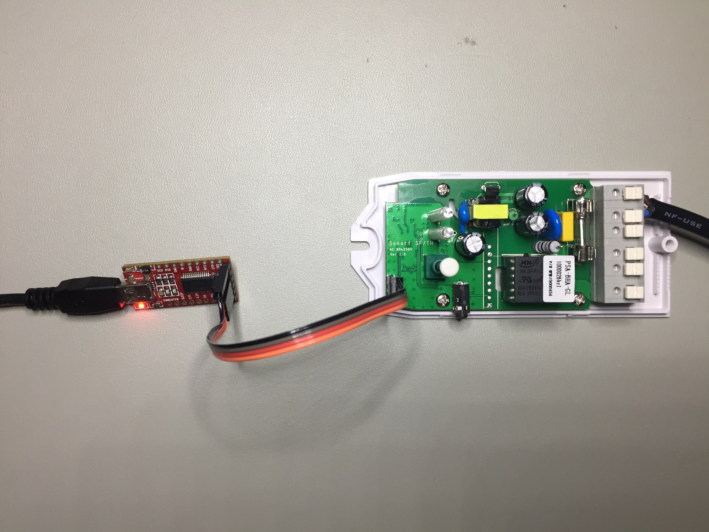
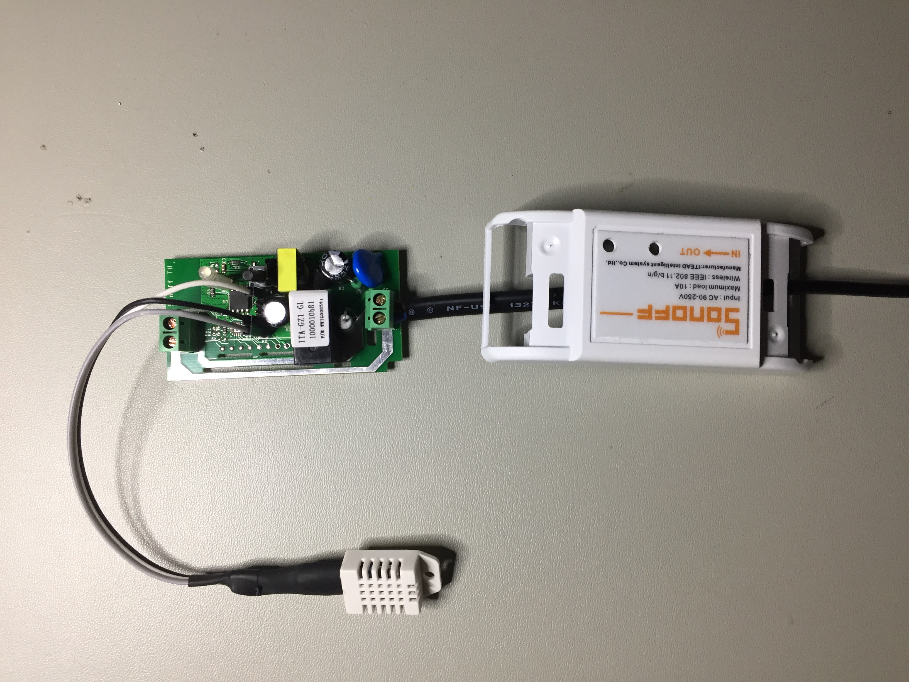
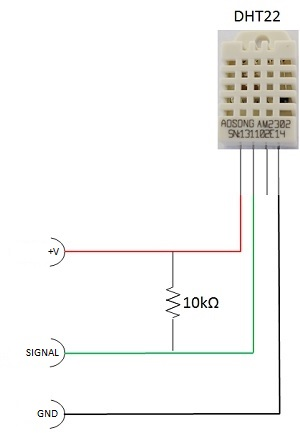
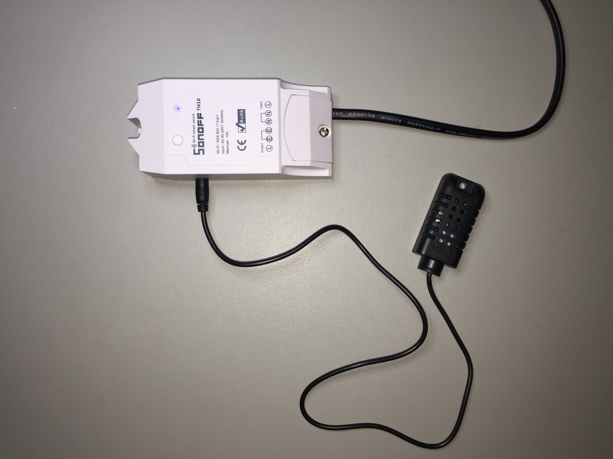

# Sonoff-HomeAssistant Description

Sonoff-HomeAssistant is alternative firmware for the brilliant & cheap ($ not quality) range of Sonoff range of ESP-8266 based WiFi controlled switches that allow you to use your own mqtt broker rather than the 'ITEAD CLOUD' service that's shipped with the pre-installed firmware. They would have to be some of the cheapest IoT switches available today. In fact, even if you knew how to build one from scratch, the components alone would cost more so why bother.

#### Supported devices :-

- Original Sonoff WiFi Wireless Smart Switch [Link](https://www.itead.cc/smart-home/sonoff-wifi-wireless-switch.html?acc=70efdf2ec9b086079795c442636b55fb)
- Sonoff TH10/TH16 Temperature and Humidity Monitoring WiFi Smart Switch [Link](https://www.itead.cc/sonoff-th.html?acc=70efdf2ec9b086079795c442636b55fb)
- Sonoff Pow WiFi Switch with Power Consumption Measurement [Link](https://www.itead.cc/sonoff-pow.html?acc=70efdf2ec9b086079795c442636b55fb)
- Sonoff Touch - Luxury Glass Panel Touch LED Light Switch [Link](https://www.itead.cc/smart-home/sonoff-touch.html?acc=70efdf2ec9b086079795c442636b55fb)
- Sonoff S20 Smart Socket - WiFi Smart Socket [Link](https://www.itead.cc/smart-home/smart-socket.html?acc=70efdf2ec9b086079795c442636b55fb)
- Sonoff SV Safe Voltage WiFi Wireless Switch Smart Home Module [Link](https://www.itead.cc/smart-home/sonoff-sv.html?acc=70efdf2ec9b086079795c442636b55fb)

It's designed to be installed with the Arduino IDE and has been tested on Arduino 1.6.13 but should be backwards & forwards compatible with other versions. I realize there are many other mqtt based firmware(s) that have been written for the Sonoff switches, but I found most of them overly complex for my liking. This firmware is basic but ***extemely stable*** and just gets the job done. There is no RTC, no OTA firmware updates, no frills what so ever just the core functionality the switch requires to turn the relay on and off (and report temperature if using that version or power consumption if using the Pow). I've found that once the mqtt topic is set and the switch has connected to your mqtt broker, you don't need to make any modifications to it ever again unless you make major infrascructure changes (i.e walls in home have moved, light becomes a fan, additional switches added in room etc). Even if you add additional switches, if your naming convention is right, the switch will not need to be touched again.

I've called the project Sonoff-HomeAssistant but the switch could be used for many of the other home automation systems that use a mqtt broker. I'm not sure why you'd want to use anything other than [Home Assistant](https://home-assistant.io/) though.

Speaking of Home Assistant, I have included a snippet of how to setup the [switch](https://home-assistant.io/components/switch.mqtt/) component in configuration.yaml and if you've installed the version that reports temperature or power the [sensor](https://home-assistant.io/components/sensor.mqtt/) component as well.

And finally, I did this to help beginners get up and running quickly with HomeAssistant and Sonoff switches. A couple of hours of work and you can have your home automated at a fraction of the cost of some of the more expensive power switches available today. 

# Installation

## 1. Clone the Repository

Clone the **Sonoff-HomeAssistant** repository to your local machine. Copy the required version for your switch to your Arduino directory. If using the temperature version of the code, you'll need the DHT library as well. It's available all over the internet.

``` bash
$ git clone https://github.com/KmanOz/Sonoff-HomeAssistant
```

## 2. Clone the lmroy/pubsubclient mqtt library to your local machine.

I use the [lmroy](https://github.com/Imroy/pubsubclient) version of this excellent mqtt library, mainly because it supports QOS1 and keepalive settings right from within the sketch. No other modifications to library files are necessary to achieve a rock solid connection to your mqtt broker.

It's currently setup to use only v3.1.1 of the mqtt standard and will only work on that version broker unless you modify the code so make sure your broker is setup to use v3.1.1 of the mqtt standard and not v3.1.

``` bash
$ git clone https://github.com/Imroy/pubsubclient
```

## 3. Modify the details in the Arduino code to your specific details and environment.

Change the WIFI_SSID, WIFI_PASS, MQTT_CLIENT, MQTT_SERVER, MQTT_PORT, MQTT_USER, MQTT_PASS in the Arduino code provided to suit your environment.

**** IMPORTANT **** MQTT_CLIENT needs to be unique for each Sonoff switch you install. MQTT_USER & MQTT_PASS can be the same but consider MQTT_CLIENT to be the equivalent of a MAC address. MQTT_CLIENT is how your broker identifies what hardware (or software for that matter) is talking to the broker at any one time and needs to be unique. So does MQTT_TOPIC unless you want 2 switches to respond to 1 topic.

``` bash
#define MQTT_CLIENT     "Sonoff_Living_Room_v1.0p"           // mqtt client_id (Must be unique for each Sonoff)
#define MQTT_SERVER     "192.168.0.100"                      // mqtt server
#define MQTT_PORT       1883                                 // mqtt port
#define MQTT_TOPIC      "home/sonoff/living_room/1"          // mqtt topic (Must be unique for each Sonoff)
#define MQTT_USER       "user"                               // mqtt user
#define MQTT_PASS       "pass"                               // mqtt password

#define WIFI_SSID       "homewifi"                           // wifi ssid
#define WIFI_PASS       "homepass"                           // wifi password
```
## 4. Modify configuration.yaml in HomeAssistant and add the following to it.

```bash
switch:
  - platform: mqtt
    name: "Living Room"
    state_topic: "home/sonoff/living_room/1/stat"
    command_topic: "home/sonoff/living_room/1"
    qos: 0
    payload_on: "on"
    payload_off: "off"
    retain: true
```
Assuming you make no changes to the topic in the code provided, you should be able to test the switch and be happy that you now have control using Home Assistant.

If you've installed the version that reports temperature, you can also setup sensors in HomeAssistant to display both Temperature & Humidity. Modify your configuration.yaml and add the following.

```bash
sensor:
  - platform: mqtt
    name: "Living Room Temp"
    state_topic: "home/sonoff/living_room/1/temp"
    qos: 1
    unit_of_measurement: "°C"
    value_template: "{{ value_json.Temp }}"
  
  - platform: mqtt
    name: "Living Room Humidity"
    state_topic: "home/sonoff/living_room/1/temp"
    qos: 1
    unit_of_measurement: "%"
    value_template: "{{ value_json.Humidity }}"
```
For the POW use the following and insert it into your configuration.yaml.

```bash
sensor:
  - platform: mqtt
    name: "Living Room Power"
    state_topic: "home/sonoff/living_room/1/power"
    qos: 1
    unit_of_measurement: "W"
    value_template: "{{ value_json.Power }}"

  - platform: mqtt
    name: "Living Room Voltage"
    state_topic: "home/sonoff/living_room/1/power"
    qos: 1
    unit_of_measurement: "V"
    value_template: "{{ value_json.Voltage }}"
```

## 5. Flash the software to the Sonoff Switch

I won't go into the specifics on how to install the code onto the Sonoff and will assume you have the necessary skills to make it happen. You'll need the Arduino IDE and you will need to move the files you just cloned to the right directories. There are plenty or articles that cover all the steps involved already published on the Internet and a Google search should get you some good results.

As for the switch modifications, it's simply a matter of opening up the switch, installing a 4 or 5 pin header (depending on switch type) and then holding down the main switch on the unit before you power it up with your FTDI adapter. You are then good to go to re-flash your new firmware. The photo below is for illustration only and different products will require the same basic connection but headers will be located in different positions etc.



If that didn't make any sense at all, I suggest you do some reading on how to install alternative software on a Sonoff switch before attempting anything else otherwise you risk turning it into toast (although it's pretty hard I have to admit).

## 6. Commands and Operation

As mentioned earlier, the commands are very basic. In fact the switch will respond to 4 basic mqtt commands and they are :-

- on (Turns the relay and LED on)
- off (Turns the relay and LED off)
- stat (Returns the status of the switch via mqtt message)
- reset (Forces a restart of the switch) (4 long flashes of the status LED)

If you've installed the version that reports temperature you have an additional option.

- temp (Forces a temperature & humidity check otherwise it's reported every 1 minute) (1 short flash of the status LED)

When power is first applied the unit will immediately connect to your WiFi access point / router and your mqtt broker. When it connects the status LED will flash fast 4 times. That's it, your connected.

If you've installed the version that reports temperature you will see a short single flash to indicate that the temperature & humidity has been published as well.

Press the switch on top to turn on the relay. Press it again to turn it off and watch the status change in HomeAssistant. Toggle the switch in HomeAssistant and the relay & LED will toggle accordingly. I could have made it more complex, but why?

To reset the switch manually, press and hold the switch for more than 4 seconds. The switch will respond with 4 long flashes and reboot.

## 7. Versions

***ESPsonoff-v1.01p - Original iTead Sonoff Switch, Sonoff Touch, Sonof S20 Smart Socket, Sonoff SV***

Firmware to control relay only with ON/FF functionality and publish via mqtt. EEPROM storage of Relay State.

***ESPsonoff-v1.01t - Original iTead Sonoff Switch***

Firmware to control relay with ON/OFF functionality and temperature reporting via DHT11/22 and publish via mqtt. EEPROM storage of Relay State.

***ESPsonoff_TH-v1.01p - TH10/16 iTead Sonoff Switch***

Firmware to control relay only with ON/FF functionality and publish it's status via mqtt. EEPROM storage of Relay State. Remote Wallswitch Support.

***ESPsonoff_TH-v1.01t - TH10/16 iTead Sonoff Switch***

Firmware to control relay with ON/OFF functionality and temperature reporting using the Sonoff Sensor-AM2301 (available from iTead) and publish via mqtt. EEPROM storage of Relay State.

***ESPsonoff_TH-v1.01pt - TH10/16 iTead Sonoff Switch***

Firmware to control relay with ON/OFF functionality and temperature reporting using the Sonoff Sensor-AM2301 (available from iTead) and publish via mqtt. EEPROM storage of Relay State. Remote Wallswitch Support.

***ESPsonoff_POW-v1.01 - iTead Sonoff Pow Switch***

Firmware to control relay with ON/OFF functionality and report power usage (Wattage) and Voltage via mqtt. EEPROM storage of Relay State

## 8. DHT22 Sensor Installation (For Original Sonoff Switch)

Installing the DHT11 or 22 sensor is relatively straight forward. DHT-11 reports only whole number values for temperture & humidity while the DHT-22 will report fractions as well. I recommend the DHT-22. In the photo below, GREY is SIGNAL (gpio14), WHITE is +V and BLACK is GND. Note how it connects to the Sonoff pins.



You will need a 10K resistor between +V and SIGNAL. In the image above, I've the soldered the 10K resistor under the heatshrink tubing so it isn't visible.



How you get the wires out of the casing after it's all assembled is completely up to you. I guess a Dremel and some handywork will be required but it's a tight squeeze. Remember... even though the switch uses a capacitor dropper and small switchmode supply to reduce mains voltage down to 3.3v, the whole circuit board is at mains potential and should be considered dangerous. BE CAREFUL.

Make sure to modify the Arduino code to indicate which sensor you are using.

``` bash
#define DHTTYPE         DHT22                                // (11 or 22) DHT Type
```

## 9. Temperature Sensor Installation (For TH10/16 Sonoff Switch)

On the newer TH series of switches it is recommended that you purchase the Sonoff Sensor-AM2301 directly from iTead rather that making one yourself. The unit has a 2.5mm phono plug that plugs directly into the TH10/16 unit and there is nothing else to do.

NOTE: I did have to enlarge the hole in the side of the top case for the plug to seat properly in the switch. If you do not make the hole bigger, you may get read errors because the plug doesn't make proper electrical connection! I'm not sure if that is a general design fault or was the case in the 2 switches that I had purchased.



## 10. HomeAssistant Community Discussion Forum

For further information and to join the discussion for this firmware please go to the HomeAssistant Community Discussion Forum [ITEAD Sonoff Wireless Smart Switch](https://community.home-assistant.io/t/sonoff-homeassistant-alternative-firmware-for-sonoff-switches-for-use-with-mqtt-ha/2332). I would be happy to answer any of your queries there.

## 11. MIT License

Copyright (c) 2017

Permission is hereby granted, free of charge, to any person obtaining a copy
of this software and associated documentation files (the "Software"), to deal
in the Software without restriction, including without limitation the rights
to use, copy, modify, merge, publish, distribute, sublicense, and/or sell
copies of the Software, and to permit persons to whom the Software is
furnished to do so, subject to the following conditions:

The above copyright notice and this permission notice shall be included in all
copies or substantial portions of the Software.

THE SOFTWARE IS PROVIDED "AS IS", WITHOUT WARRANTY OF ANY KIND, EXPRESS OR
IMPLIED, INCLUDING BUT NOT LIMITED TO THE WARRANTIES OF MERCHANTABILITY,
FITNESS FOR A PARTICULAR PURPOSE AND NONINFRINGEMENT. IN NO EVENT SHALL THE
AUTHORS OR COPYRIGHT HOLDERS BE LIABLE FOR ANY CLAIM, DAMAGES OR OTHER
LIABILITY, WHETHER IN AN ACTION OF CONTRACT, TORT OR OTHERWISE, ARISING FROM,
OUT OF OR IN CONNECTION WITH THE SOFTWARE OR THE USE OR OTHER DEALINGS IN THE
SOFTWARE.

## 12. Conclusion

That's about it. Any feature suggestions are welcome and I would be happy to answer any further questions that you may have.


Enjoy!
